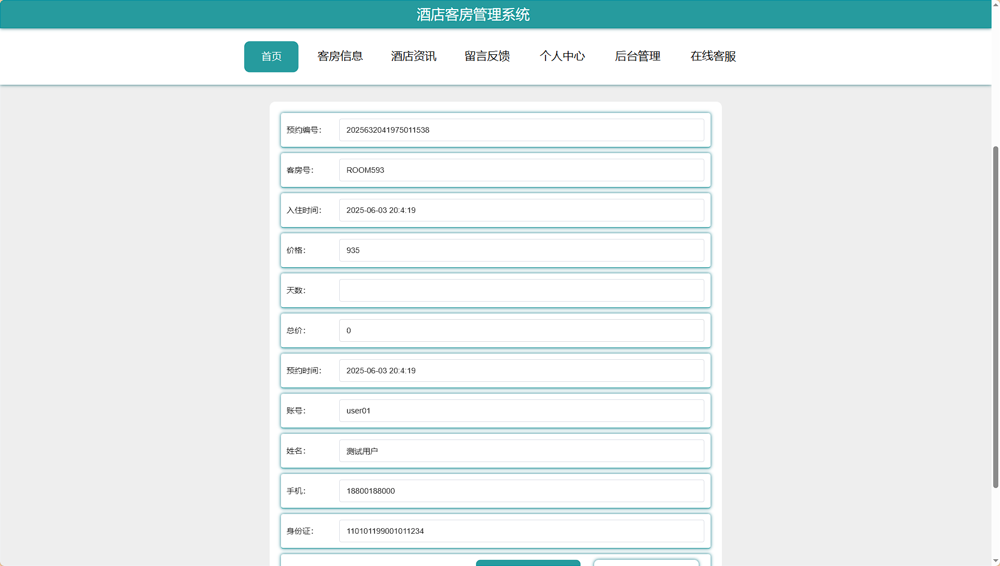
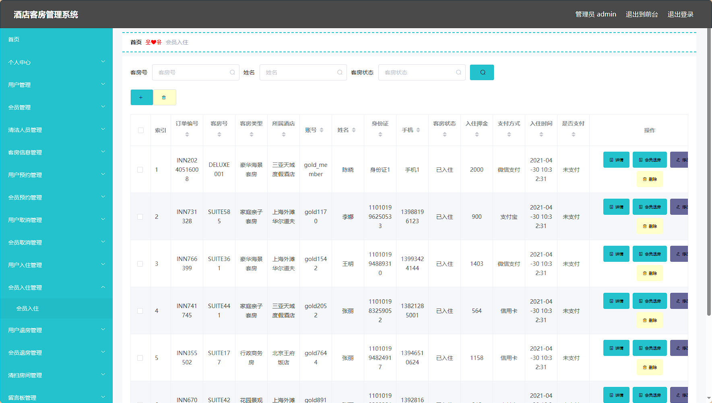
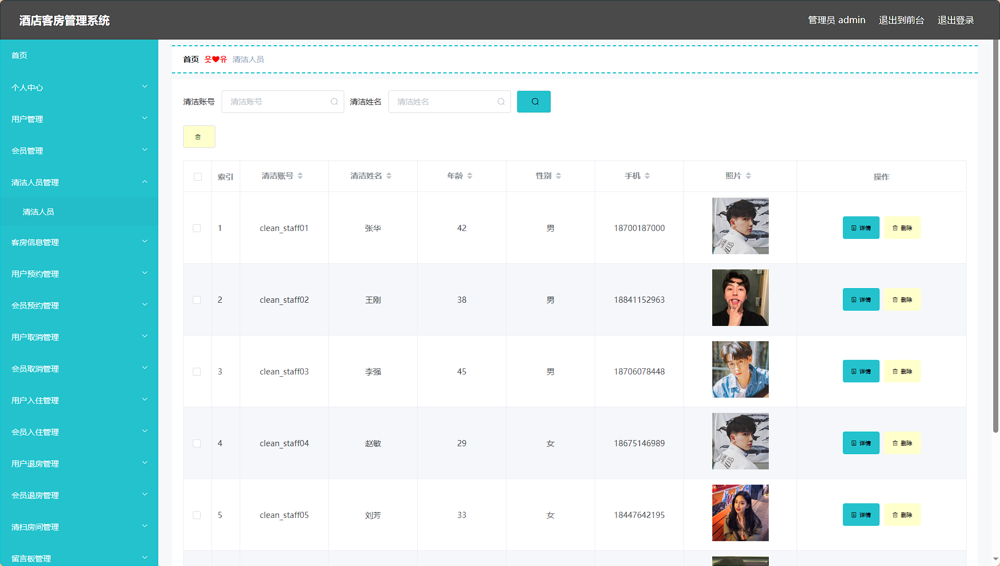

# springboot-基于web的酒店客房管理系统 / springboot-Hotel_Room_Management_System


> 更多毕设项目可跳转至项目导航栏检索：[毕设项目](http://sysadmin.3vfree.vip)，需要联系博主v：xq-lucky311，q：1047944234. 备注：项目咨询

注：由于前端项目太大，仅上传了后端代码，未包含前端代码...

## 项目简介  
基于 SpringBoot + Vue + MyBatis-Plus 的 B/S 架构酒店管理系统，包含管理员、用户、会员和清洁人员四类角色，实现客房信息管理、预约/取消、入住/退房、清扫管理等核心业务，采用前后端分离架构保证系统稳定性。

## 特征介绍  
- **权限控制**：Shiro 安全框架实现角色权限管理，自定义注解（@LoginUser）实现接口鉴权。  
- **高效开发**：MyBatis-Plus 简化单表操作，代码生成器自动生成基础 CRUD 功能。  
- **分层架构**：严格遵循 Controller-Service-DAO 三层架构，实体层细分 VO/Model/View 多维度数据模型。  
- **文件管理**：集成 FileController 实现上传/下载功能，支持静态资源统一管理。  
- **接口文档**：RESTful 风格 API 设计，Postman 可直接测试接口。  

## 代码结构 
```
src/
├── main/
│ ├── java/
│ │ ├── com/
│ │ │ ├── SpringbootSchemaApplication.java # 启动类
│ │ │ ├── annotation/
│ │ │ │ ├── APPLoginUser.java # 自定义鉴权注解
│ │ │ │ ├── IgnoreAuth.java # 免鉴权注解
│ │ │ ├── config/
│ │ │ │ ├── InterceptorConfig.java # 拦截器配置
│ │ │ │ ├── MybatisPlusConfig.java # MyBatis配置
│ │ │ ├── controller/
│ │ │ │ ├── HuiyuanController.java # 会员管理接口
│ │ │ │ ├── HuiyuanquxiaoController.java # 取消管理接口
│ │ │ ├── dao/
│ │ │ │ ├── HuiyuanDao.java # 会员数据访问
│ │ │ │ ├── HuiyuanruzhuDao.java # 入住数据访问
│ │ │ ├── entity/
│ │ │ │ ├── HuiyuanEntity.java # 会员实体
│ │ │ │ ├── model/
│ │ │ │ │ ├── HuiyuanModel.java # 会员业务模型
│ │ │ │ ├── view/
│ │ │ │ │ ├── HuiyuanView.java # 会员视图对象
│ │ │ │ ├── vo/
│ │ │ │ │ ├── HuiyuanVO.java # 会员值对象
│ │ │ ├── interceptor/
│ │ │ │ ├── AuthorizationInterceptor.java # 权限拦截器
│ │ │ ├── service/
│ │ │ │ ├── HuiyuanService.java # 会员服务接口
│ │ │ │ ├── impl/
│ │ │ │ │ ├── HuiyuanServiceImpl.java # 服务实现
│ │ │ ├── utils/
│ │ │ │ ├── MD5Util.java # 加密工具
│ │ │ │ ├── FileUtil.java # 文件处理工具
│ ├── resources/
│ │ ├── application.yml # 主配置文件
│ │ ├── mapper/ # MyBatis映射
│ │ │ ├── HuiyuanDao.xml # 会员SQL映射
│ │ │ ├── HuiyuanruzhuDao.xml # 入住SQL映射


## 使用说明
1. **运行环境**  
   - 数据库：MySQL  
   - 浏览器：谷歌浏览器  

2. **访问地址**  
   - 后台管理：`http://localhost:8080/springboot6alf1/admin/dist/index.html`  
   - 前台系统：`http://localhost:8080/springboot6alf1/front/index.html`  

3. **管理员账号**  
   - 账号：`abo`  
   - 密码：`abo`  

4. **数据库配置**  
   修改 `src/main/resources/application.yml`：  
   ```yaml
   url: jdbc:mysql://127.0.0.1:3306/springboot6alf1?useUnicode=true&characterEncoding=utf-8
   username: root
   password: 123456  # 改为实际数据库密码
```

# 项目实际截图：
## 登录：


## 前台：





## 后台：








> 等等...

# 精选项目导航 & 快速部署工具
## 项目资源一站直达
- ​**访问项目导航站**：[点击进入](http://sysadmin.3vfree.vip)**快速检索所需项目名称**
- ​**技术栈全覆盖**：Java/SSm/Spring Boot/小程序等主流技术方案
- ​**配套资源**：每个项目均提供部署文档 + 演示视频（附效果截图）

### ▌导航站预览


### ▌工具界面预览


## 捐赠
> 博主将持续更新Java全栈开发项目，包含ssm，springboot，前后端分离系统等项目。
> 此外如果您够宽裕，请博主喝杯咖啡吧！捐赠将用于服务器维护与开源社区建设，感谢您的认可！
> 如需更多Java相关项目毕设3000+，有其他项目需求，sql文件等可联系博主v:xq-lucky311

---
